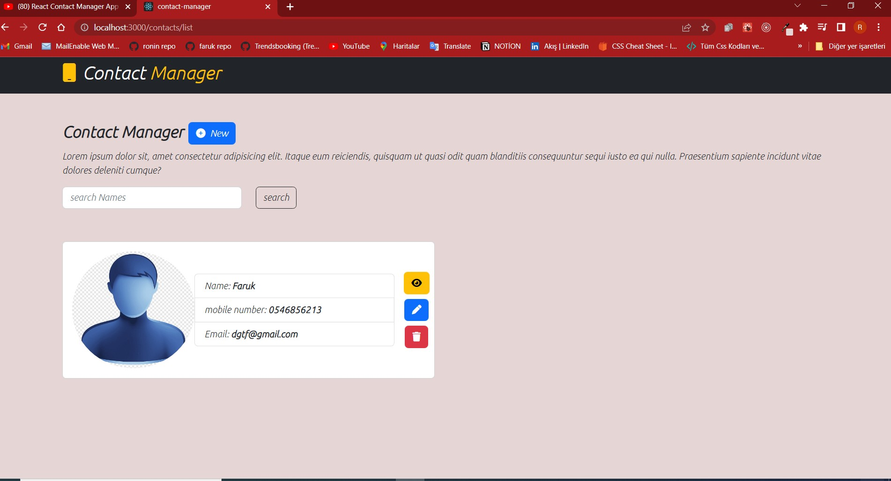

# başlarken:
 ````
   npm i bootstrap
   npm i @fortawesome/fontawesome-free
   yarn add axios
    yarn add react-router-dom@6.2.1
````

````
<link
      rel="stylesheet"
      href="https://cdnjs.cloudflare.com/ajax/libs/font-awesome/5.15.4/css/all.min.css"
      integrity="sha512-1ycn6IcaQQ40/MKBW2W4Rhis/DbILU74C1vSrLJxCq57o941Ym01SwNsOMqvEBFlcgUa6xLiPY/NS5R+E6ztJQ=="
      crossorigin="anonymous"
      referrerpolicy="no-referrer"
    />
````

#
proje structure

components
        |_navbar
        |_contact-list
        |_view-contact
        |_edit-contact
        |_add-contact

services
        |_contactService


# index.js

````
import React from 'react';
import ReactDOM from 'react-dom/client';
import './index.css';
import App from './App';
import {BrowserRouter} from 'react-router-dom'


// fontawesome icons
import "../node_modules/@fortawesome/fontawesome-free/css/all.css";

// Bootstrap 5.2
import "../node_modules/bootstrap/dist/css/bootstrap.css";
import "../node_modules/bootstrap/dist/js/bootstrap.bundle";

const root = ReactDOM.createRoot(document.getElementById('root'));
root.render(
  <React.StrictMode>
    <BrowserRouter>
    <App />
    </BrowserRouter>
    
  </React.StrictMode>
);

````
# App.js
````
import React from "react";
import "./App.css";
import { Routes, Route, Navigate } from "react-router-dom";
import NavBar from "./components/NavBar/NavBar";
import ContactList from "./components/contacts/ContactList/ContactList";

function App() {
  return (
    <>
      <NavBar />
      <Routes>
        <Route path={"/"} element={<Navigate to={"/contacts/list"} />} />
        <Route path={"/contacts/list"} element={<ContactList />} />
      </Routes>
    </>
  );
}

export default App;
````

````
<Route path={"/"} element={<Navigate to={"/contacts/list"} />} />
````
"/" olduğunda bile direk "/contacts/list" e yönlenir demek


# NavBar.js
````
import React from "react";
import { Link } from "react-router-dom";

const NavBar = () => {
  return (
    <>
      <nav className="navbar navbar-dark bg-dark navbar-expand-sm">
        <div className="container">
          <h2>
            <Link to={"/"} style={{ color: "white", textDecoration: "none" }}>
              <i
                className="fa fa-mobile text-warning"
                style={{ marginRight: "10px" }}
              ></i> 
              Contact <span className="text-warning">Manager</span>
            </Link>
          </h2>
        </div>
      </nav>
    </>
  );
};

export default NavBar;
````

# ContactList.js
````
import React from "react";
import { Link } from "react-router-dom";

const ContactList = () => {
  return (
    <>
      <section className="contact-search p-5">
        <div className="container">
          <div className="grid">
            <div className="row">
              <div className="col">
                <p className="h3">
                  Contact Manager
                  <Link to={"/contacts/add"} className="btn btn-primary ms-2">
                    {" "}
                    <i className="fa fa-plus-circle me-2"></i>New
                  </Link>
                </p>
                <p className="fst-italic">
                  Lorem ipsum dolor sit, amet consectetur adipisicing elit.
                  Itaque eum reiciendis, quisquam ut quasi odit quam blanditiis
                  consequuntur sequi iusto ea qui nulla. Praesentium sapiente
                  incidunt vitae dolores deleniti cumque?
                </p>
              </div>
            </div>
          </div>
        </div>
      </section>
    </>
  );
};

export default ContactList;
````

